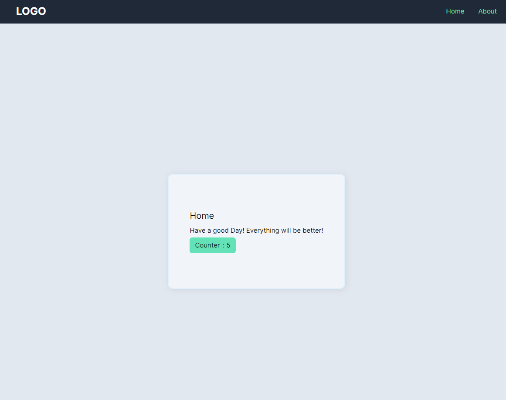

# init Vue with typescript,tailwindcss

## Quick Start
```bash
npx degit github:lucashsu95/init-vue my-app
pnpm i
```

### Haven't pnpm?
```bash
npm install -g pnpm
```



## Has Package
- typescript
- prettier
- vue router
- pinia
- postcss
- vitest
- eslint
  - eslint-config-prettier
  - eslint-plugin-prettier
  - eslint-plugin-vue
- css
  - tailwindcss
  - autoprefixer
  - postcss